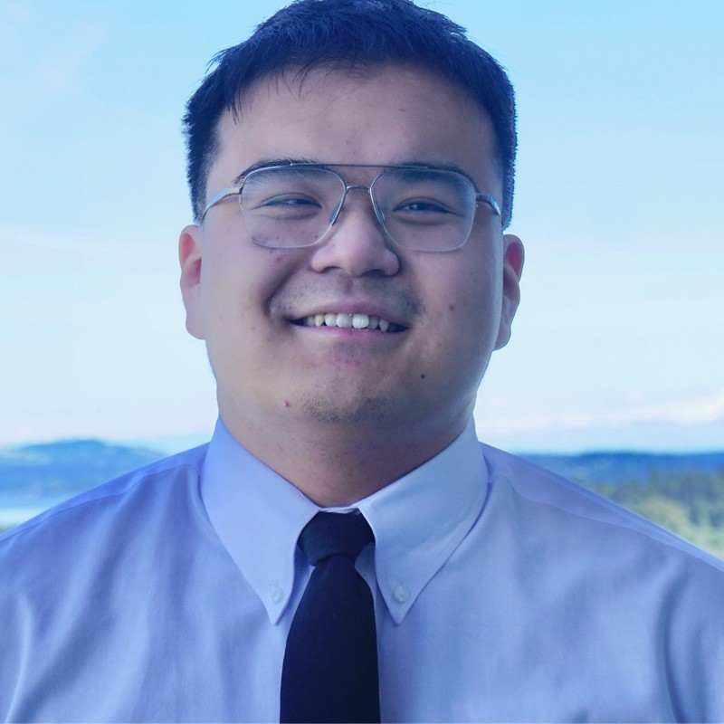

# About Me

Hello! My name is Henry Lam and welcome to my GitHub page!

## Background

I am currently a 2nd year electrical and computer engineering student at the University of Washington. I was born and raised in Renton, Washington. I am currently exploring what to do after graduation, however, I am currently interested in working with semiconductors or with consumer electronics such as phones or video game consoles!

## Hobbies

The table below showcases my hobbies and how long I have been doing them.

| Hobby | Time |
|---------:|------------|
| Bowling   | 1 year and a half    |
|  TFT    | Playing competitively for 3 years    |
|  Basketball     |    2 weeks   |

## Music

Here is a list of some of my favorite music artists:

- [Le Sserafim](https://open.spotify.com/artist/4SpbR6yFEvexJuaBpgAU5p?si=2kFl0e1nRqCaYcYCYlDphw)
- [My Chemical Romance](https://open.spotify.com/artist/7FBcuc1gsnv6Y1nwFtNRCb?si=BBVmKho5SFCMaK8d8FbHGA)
- [Giveon](https://open.spotify.com/artist/4fxd5Ee7UefO4CUXgwJ7IP?si=hldcz8tzRSeNDeoPqUTIUg)
- [Laufey](https://open.spotify.com/artist/7gW0r5CkdEUMm42w9XpyZO?si=pZwGkmAeRtKm0CXrj9vicw)
- [Jack Harlow](https://open.spotify.com/artist/2LIk90788K0zvyj2JJVwkJ?si=ReVlOGQ1QvuRt26JFmPzZQ)
- [Lamp](https://open.spotify.com/artist/0rFHElzeddB9ymDjgpBENX?si=5_SbQbqSQwCv0uKFZsNhYw)

My music taste changes 
